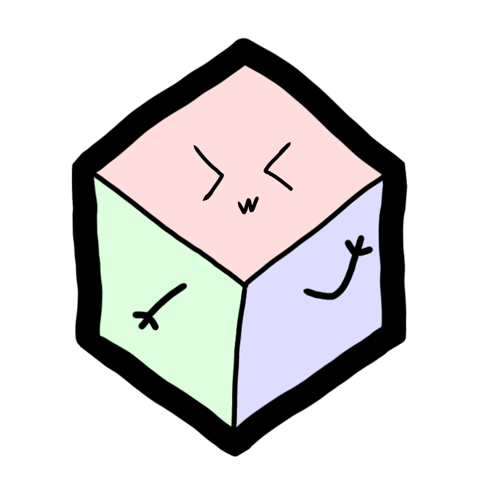

# Deso + Unity = Desonity

</img>

A Unity3D package for interacting with the DeSo blockchain 💎

## Important

**This package is still in development and its methods might change very quick. If you are using this in your unity project, there's a hig chance it will break in the future**. see [changelog](./CHANGELOG.md)

Latest stable version is [0.0.6](https://github.com/desonity/desonity/releases/tag/0.0.6)

## [Installation](https://desonity.github.io/docs/#installation)

## [Documentation](https://desonity.github.io/docs/)

If you are using Desonity consider supporting me on Deso [@weeblet](https://diamondapp.com/u/weeblet) and feel free to show me your creative implementaitons of this package ;)
